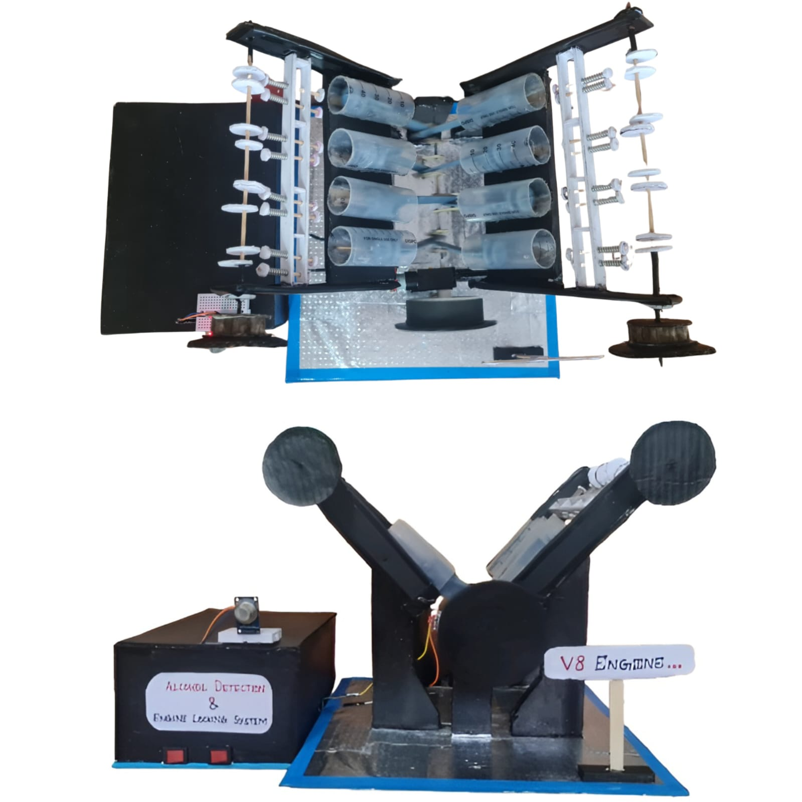
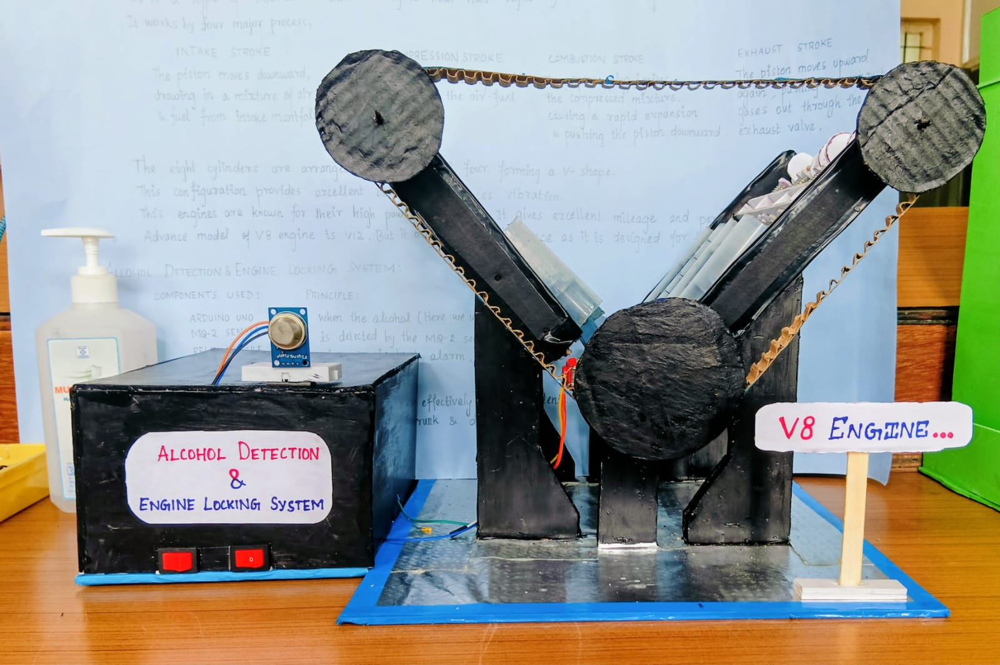
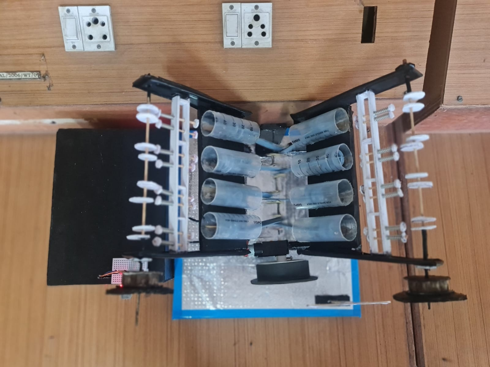
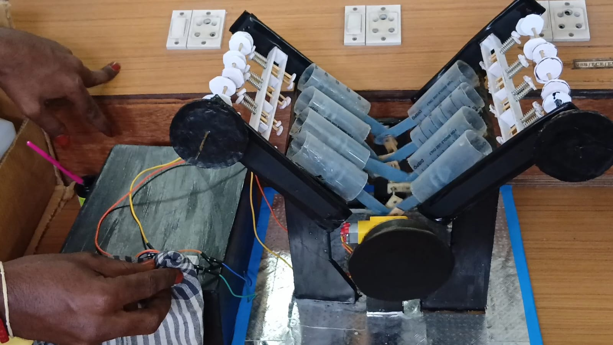

# 🚗 V8 Engine with Alcohol Detection and Engine Locking System

An intelligent vehicle safety prototype that integrates a **V8 engine model** with an **alcohol detection and automatic engine-locking system**. The system detects alcohol concentration near the driver and automatically prevents engine operation when the detected alcohol level exceeds a predefined safety threshold.

The main objective of this project is to reduce drunk-driving incidents by combining **real-time alcohol monitoring**, **automatic engine control**, and **embedded system technology**.

---

## 📌 Project Overview

Drunk driving is one of the major causes of road accidents worldwide. Traditional vehicles depend entirely on the driver's responsibility and do not have an automatic mechanism to detect alcohol consumption before starting the engine.

This project provides a smart safety solution using an **alcohol sensor** and a **microcontroller-based control system**. The alcohol sensor continuously monitors the driver's breath. The detected alcohol value is processed by the microcontroller and compared with a predefined threshold.

If the detected alcohol level is within the safe range, the engine is allowed to operate normally. If the alcohol level exceeds the safety threshold, the system activates the engine-locking mechanism and prevents the engine from operating.

---

## ✨ Key Features

* Real-time alcohol-level detection
* Automatic engine locking during unsafe conditions
* Prevents engine operation when alcohol is detected
* Microcontroller-based automated decision-making
* Immediate warning indication
* Real-time sensor monitoring
* Low-cost vehicle safety solution
* V8 engine working model integration
* Designed to improve driver and road safety

---

## 🏗️ System Architecture

```text
┌──────────────────────┐
│   Driver's Breath    │
└──────────┬───────────┘
           │
           ▼
┌──────────────────────┐
│    Alcohol Sensor    │
│  Detects Alcohol Gas │
└──────────┬───────────┘
           │
           │ Sensor Data
           ▼
┌──────────────────────┐
│ ESP32 /              │
│ Microcontroller      │
│                      │
│ Processes Sensor     │
│ Value and Compares   │
│ with Threshold       │
└──────────┬───────────┘
           │
           ▼
      ┌─────────┐
      │ Alcohol │
      │ Level > │
      │ Limit?  │
      └────┬────┘
           │
     ┌─────┴─────┐
     │           │
    NO          YES
     │           │
     ▼           ▼
┌──────────┐  ┌──────────────┐
│ Engine   │  │ Warning      │
│ Enabled  │  │ Alert        │
└────┬─────┘  └──────┬───────┘
     │                │
     ▼                ▼
┌──────────┐  ┌──────────────┐
│ V8 Model │  │ Engine Lock  │
│ Operates │  │ Activated    │
└──────────┘  └──────────────┘
```

---

## 🔄 Working Principle

1. The alcohol sensor detects the alcohol concentration near the driver's breath.

2. The detected sensor value is continuously transmitted to the ESP32 or microcontroller.

3. The microcontroller processes the sensor data and compares it with a predefined alcohol safety threshold.

4. If the detected alcohol concentration is below the threshold:

   * The engine control system remains enabled.
   * The V8 engine model is allowed to operate normally.

5. If the detected alcohol concentration exceeds the threshold:

   * The microcontroller activates the engine-locking mechanism.
   * The engine operation is automatically disabled.
   * A warning alert can be generated using a buzzer or LED indicator.

6. The engine remains locked until the alcohol concentration returns to the permitted safety range.

---

## 🔁 System Flow

```text
Start
  │
  ▼
Initialize Microcontroller
  │
  ▼
Initialize Alcohol Sensor
  │
  ▼
Read Alcohol Sensor Value
  │
  ▼
Compare Value with Safety Threshold
  │
  ▼
Is Alcohol Level Above the Limit?
  │
  ├──────── NO ────────► Enable Engine
  │                         │
  │                         ▼
  │                  Run V8 Engine Model
  │
  └──────── YES ───────► Activate Warning
                            │
                            ▼
                       Lock Engine
                            │
                            ▼
                    Prevent Engine Operation
```

---

## 🧰 Hardware Components

| Component               | Purpose                                              |
| ----------------------- | ---------------------------------------------------- |
| ESP32 / Microcontroller | Processes sensor data and controls the system        |
| Alcohol Sensor          | Detects alcohol concentration in the driver's breath |
| V8 Engine Model         | Demonstrates engine operation                        |
| Relay Module            | Enables or disables the engine                       |
| DC Motor                | Provides mechanical movement for the engine model    |
| Buzzer                  | Generates an alert when alcohol is detected          |
| LED Indicator           | Displays the current safety status                   |
| Power Supply            | Supplies power to the complete system                |
| Connecting Wires        | Establish electrical connections                     |

---

## 💻 Software and Technologies

* Embedded Systems
* Internet of Things (IoT)
* ESP32
* Arduino IDE
* Embedded C/C++
* Sensor Integration
* Real-Time Monitoring
* Microcontroller Programming
* Automatic Engine Control

---

## 📷 Project Images

### V8 Engine Model



### Side View



### Top View



### Working Model



---

## 🎯 Project Objectives

The primary objectives of this project are:

* To detect alcohol consumption before allowing engine operation
* To prevent vehicles from operating under unsafe conditions
* To develop an automatic engine-locking mechanism
* To demonstrate sensor integration with a V8 engine prototype
* To improve vehicle and road safety using embedded technology
* To reduce the risk of accidents caused by drunk driving

---

## 🚘 Applications

This system can be implemented in:

* Personal vehicles
* Public transportation
* School and college buses
* Commercial vehicles
* Taxi and cab services
* Heavy transport vehicles
* Industrial transportation systems
* Vehicle safety research prototypes

---

## 🚀 Future Enhancements

The project can be enhanced by integrating:

* GPS-based real-time vehicle tracking
* GSM alerts to emergency contacts
* IoT-based remote monitoring dashboard
* Mobile application integration
* Cloud-based alcohol detection records
* Driver identification using facial recognition
* Automatic location sharing
* Real-time notifications to vehicle owners
* Emergency contact alerts
* AI-based driver behavior monitoring

---

## ⚠️ Limitations

* Sensor readings may be affected by environmental gases.
* The alcohol sensor requires proper calibration.
* The current system is developed as a prototype.
* Real-vehicle implementation requires automotive-grade safety components and extensive testing.

---

## 📊 Expected Outcome

The system successfully demonstrates how alcohol detection can be integrated with an automatic engine-control mechanism. When the alcohol concentration exceeds the predefined safety threshold, the engine is automatically disabled. When the detected alcohol level is within the permitted range, normal engine operation is allowed.

---

## 👨‍💻 Developed By

**Brijesh Balaji S**

Electronics and Communication Engineering
VSB Engineering College, Karur

---

## 📄 License

This project is developed for educational, research, and demonstration purposes.

---

⭐ If you found this project useful, consider giving the repository a **star**.
